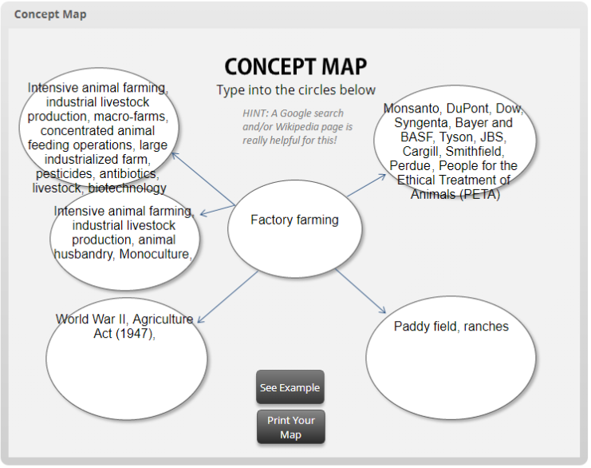

# Journal Entry #5 Assignment

- [Journal Entry #5 Assignment](#journal-entry-5-assignment)
  - [1) Click on the link below and create your own concept map based on the topic of Project #1 assignment (Food Inc. issue)](#1-click-on-the-link-below-and-create-your-own-concept-map-based-on-the-topic-of-project-1-assignment-food-inc-issue)
  - [2) Answer the questions below](#2-answer-the-questions-below)
    - [1. Which filters or other features of the database are you using and/or finding most helpful?](#1-which-filters-or-other-features-of-the-database-are-you-using-andor-finding-most-helpful)
    - [2. Explain how the different TYPES of sources you see in your search results might inform your topic](#2-explain-how-the-different-types-of-sources-you-see-in-your-search-results-might-inform-your-topic)
    - [3. List at least 2 ways that you are identifying new keywords](#3-list-at-least-2-ways-that-you-are-identifying-new-keywords)
    - [4. What other aspects related to your topic are you noticing in your search results? How might these new ideas change your search strategy?](#4-what-other-aspects-related-to-your-topic-are-you-noticing-in-your-search-results-how-might-these-new-ideas-change-your-search-strategy)
    - [5. What is the most difficult thing about this search? What is not working, and what can you change to modify your approach?](#5-what-is-the-most-difficult-thing-about-this-search-what-is-not-working-and-what-can-you-change-to-modify-your-approach)

Please click on the link below and complete the Library Research Tutorial.
(While the tutorial is designed for first-year students, it’s also beneficial
for students enrolled in more advanced writing courses.)

<https://rise.articulate.com/share/hDCbukjBCOpmgQYw9xyedotoJuQ0gVIO>

After you finish the five lessons in the tutorial:

1. Concept Mapping
2. Finding Information: Let's Start with a Question
3. How Can You Get Access to the Most Information?
4. Types of Information Sources
5. How to Search for Articles: Academic Search Complete

Please complete the following two tasks:

## 1) Click on the link below and create your own concept map based on the topic of Project #1 assignment (Food Inc. issue)

Don’t forget to save your concept map as a PDF file and submit
the map along with your Journal #5 answers to Canvas.

<https://library.csus.edu/guides/concept-map/story_html5.html>

## 2) Answer the questions below

### 1. Which filters or other features of the database are you using and/or finding most helpful?

Google scholar (https://scholar.google.com/) filter for articles is most helpful
for the "factory farming" topic.

### 2. Explain how the different TYPES of sources you see in your search results might inform your topic

Scholarly resources are a great source for reliable, peer reviewed, data and
case studies and it provides an objective lens on a particular topic; in
contrast, popular resources are subjective in their findings often best used,
so a long as you're not just using one publisher, to provide public "mood" and
subjective attitude towards the particular topic.

### 3. List at least 2 ways that you are identifying new keywords

The two ways that one can identify key words are

1. A specific, unique, word is only used in a particular context to the topic
2. Most proper nouns that appear often with specific or related topic

### 4. What other aspects related to your topic are you noticing in your search results? How might these new ideas change your search strategy?

Other aspects related to my topic are:

- Animal welfare
- Aquaculture
- Environmental impact
- Human health impact
- Regulation

These provide insight to possible policies considered or made, explore what are
the controversies and criticisms, other industries affected, and people
involved.

### 5. What is the most difficult thing about this search? What is not working, and what can you change to modify your approach?

The most difficult thing about this search is defining a proper scope without
going beyond just "factory farming", for as an industry it affects peoples diets,
wages, trade, policies made, and ect.
